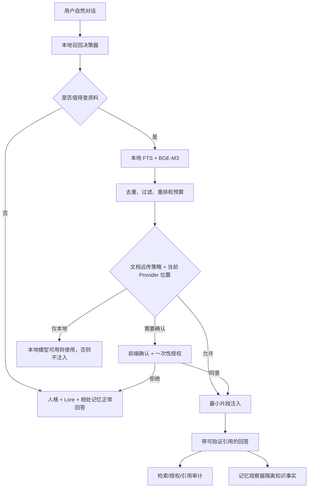

# 遐蝶知识库优化施工计划（零基础审查版）

版本：v1.1

制定日期：2026-07-16

状态：施工中；K.0～K.5 已完成，下一阶段 K.6
适用对象：项目所有者、后续施工的 Codex、第一次接触检索系统的开发者

---

## 0.1 临时施工接管审计（2026-07-19）

额度受限期间曾依据 `COMPREHENSIVE_EXECUTION_PLAN_v1.0.md` 提前写入 K.6～K.9、SEC.1～SEC.3
的部分实现。该综合计划现已停用；代码暂不回滚，但其勾选状态不继承到本计划。

接管结论：

- [x] K.0～K.5 的既有验收仍然有效。
- [x] 临时施工代码和提交已识别并保留，没有用回退覆盖成果。
- [ ] K.6 尚未验收：已有知识引用元数据和来源标记原型，但写入硬门仍可被错误来源标记绕过，确认规则与失败隔离测试也不完整。
- [ ] K.7 尚未验收：已有查询清理、规则重排和多样性原型，但查询清理未接入召回链路，多样性选择在当前调用顺序中不会稳定生效，也没有新协议离线对比。
- [ ] K.8 尚未验收：已有文档召回统计和审计清理原型，但 retrieval 清理会级联删除 citation，与引用保留约束冲突；collection 批量策略、完整清除和专项测试仍缺失。
- [ ] K.9 尚未验收：现有 374 项后端测试、32 项前端测试、生产构建和 Electron 语法检查通过，但不能替代 K.6～K.8 的缺失验收。
- [ ] 临时增加的 SEC.1～SEC.3 不计入知识库阶段进度：SecretStore 仍以明文 SQLite 为默认实现且业务读取仍依赖 `providers.api_key`；上下文裁剪不能保证落入预算；这些代码冻结，待知识库主线完成后另立小阶段处理。

恢复后的下一步：从 K.6 开始，先补强知识来源写入硬门和端到端隔离测试；完成一个小阶段后按本计划审查规则打勾，再进入 K.7。

---

## 1. 这份计划要解决什么问题

当前知识库已经能完成：

1. 用户明确导入 TXT、Markdown、PDF、DOCX。
2. 在本地解析、切片并建立 FTS 和 BGE-M3 dense 向量索引。
3. 用户明确说“查资料”“根据文档”等表达时检索知识库。
4. 把少量命中片段交给聊天模型，并显示可验证引用。
5. 重建或删除时同步清除原文副本、切片、FTS 和向量。

但它还不具备陪伴型 Agent 应有的自然知识使用能力：用户不明确说“查知识库”时，遐蝶不会自己想到去翻资料。
如果简单地改成“每轮都检索并注入”，又会产生隐私、误召回、费用和人格污染问题。

本计划的目标是实现：

> 遐蝶可以在自然对话中先在本地判断资料是否有帮助；只有真正相关、符合文档数据策略并获得必要授权时，
> 才把最少量的资料片段交给当前聊天模型。

本计划只规定后续施工顺序，本次不修改运行逻辑。

---

## 2. 当前真实基线

截至制定本计划时：

- 数据库版本：schema 35。
- 后端测试：317 项通过。
- 前端测试：25 项通过。
- 支持格式：TXT、Markdown、PDF、DOCX。
- 本地词法索引：SQLite contentless FTS5。
- 本地语义索引：BGE-M3 量化 ONNX，1024 维 dense 向量。
- 默认检索：FTS 与 dense 使用 RRF 混合；向量失败时自动降级 FTS。
- 对话触发：只识别明确资料意图，普通自然对话不查询用户文件。
- 引用：只接受本轮白名单中的 `[资料:Kx]`，点击时重新核对来源状态和哈希。
- 删除：请求成功后立即退出召回，再清理应用内原文、解析产物、切片、FTS、向量和 document。
- 远程向量：没有启用；本地建向量不上传正文。
- 在线聊天：明确检索命中的片段可能随本轮请求发送给当前在线聊天模型。
- 文档远传策略：普通新文档默认逐次询问，敏感新文档默认仅本地；旧文档保守迁移为逐次询问。
- Provider 数据位置：local/remote/unknown 已显式版本化，unknown 按 remote 处理。

对应实现基线：ADR-0029～ADR-0035，以及记忆系统设计书阶段 F。

### 2.1 当前明确没有实现的能力

- 自然对话本地预检。
- 发送片段前的逐次授权凭证。
- 智能召回影子模式和阈值校准数据集。
- 知识引用与记忆观察器之间的显式隔离元数据。
- 本地 reranker、MMR 多样性选择和正式离线检索评测。
- 检索审计的统一保留、归档和清理策略。
- 扫描 PDF OCR、XLSX、图片和网页导入。

---

## 3. 零基础术语说明

| 名词 | 通俗解释 |
|---|---|
| 文档 Document | 用户导入的一整份文件。 |
| 切片 Chunk | 从文档中切出、可单独检索的一小段文字。 |
| FTS | 按关键词找资料，适合准确的人名、术语和原句。 |
| Embedding | 把文字变成数字向量，用于寻找语义相近的内容。 |
| Dense 向量 | 每段文字对应一组稠密数字；当前为 1024 维。 |
| 混合检索 | 同时使用 FTS 和向量，再合并两边结果。 |
| RRF | 不直接比较两套分数，而按各自名次合并的稳定方法。 |
| 召回 | 从知识库找出可能有用的候选切片。 |
| 重排 | 对候选做第二次更精细的相关性排序。 |
| 注入 | 把最终少量片段放进聊天模型本轮上下文。 |
| 本地预检 | 只在用户电脑上判断是否需要资料，不发送正文。 |
| 影子模式 | 运行判断并记录结果，但暂时不改变回复。 |
| 远传策略 | 一份文档是否允许片段发送给在线模型。 |
| 授权凭证 | 用户同意本次发送后生成的、短期且一次性的许可。 |
| 来源定位 Locator | 文件名、标题、页码、段落、行号和字符范围。 |
| 误召回 | 找到的资料看似相似，但实际上不该用于当前问题。 |
| 污染记忆 | 把外部资料事实错误保存成双方真实相处经历。 |

---

## 4. 最终知识库形态



最终系统应具备四条互不混淆的数据线：

1. **人格**：规定遐蝶是谁，知识文件不能修改它。
2. **Lore**：角色原作背景，由项目维护者管理。
3. **相处记忆**：用户和遐蝶真实发生过的互动。
4. **用户知识**：用户明确导入、可引用和可删除的外部资料。

---

## 5. 不可违反的设计原则

### 5.1 本地想到，不等于允许远传

本地检索可以发现资料相关，但不能自动推导出“用户同意把片段交给在线模型”。检索授权和传输授权必须分开。

### 5.2 默认行为保持兼容

升级后默认仍为“仅明确请求”。智能召回必须由用户主动开启，不能通过数据库迁移悄悄改变现有隐私行为。

### 5.3 不用在线模型判断要不要读取本地文件

自然召回的第一道判断必须使用本地规则、FTS、BGE-M3 和本地统计。不能为了决定是否查资料，先把用户消息或
文档摘要发送给另一个远程分类模型。

### 5.4 不以单一向量相似度决定注入

BGE-M3 的绝对分数会随内容类型变化。必须结合词法命中、实体、分数差、文档范围、历史话题和评测阈值，
不能写一个未经验证的固定数字后直接自动发送资料。

### 5.5 最少发送

自然召回默认最多 2～3 个切片、600～800 token；明确检索可以使用更大的独立预算。不能发送整份文件。

### 5.6 来源必须继续可验证

智能召回不能绕过现有 citation 白名单、chunk 哈希、document 状态和 locator 校验。

### 5.7 知识事实不能冒充相处记忆

可以记住“我们一起查过某份资料”“用户认可了某个结论”，但不能把文档中的世界设定直接写成双方亲历事实。

### 5.8 失败时宁可不用资料

预检超时、模型位置未知、授权失效、来源变化、向量损坏或策略冲突时，回到普通对话或 FTS，不伪造资料依据。

---

## 6. 三种召回模式

设置项暂定为 `knowledge_recall_mode`：

| 模式 | 行为 | 默认 |
|---|---|---|
| `off` | 对话不查询用户文件；管理页手动搜索仍可用。 | 否 |
| `explicit` | 只有明确说“查资料/根据文档”等表达才召回。 | 是 |
| `smart` | 自然对话先做本地预检，高置信度时继续走策略判断。 | 否 |

模式变化必须写设置事件，但事件不保存用户消息和查询正文。

### 6.1 智能模式也不应检索的情况

- 普通问候、告别和寒暄。
- 纯情绪表达，用户主要需要陪伴回应。
- 简单计算、格式转换或不依赖资料的操作。
- 消息只有无明确指向的“嗯”“然后呢”“你觉得呢”。
- 用户明确要求不要查资料。
- 当前会话处于敏感/隐私临时模式。

### 6.2 智能模式适合检索的情况

- 出现知识库已有的明确人物、地点、项目、术语或文件标签。
- 用户追问“她和谁是什么关系”“那个项目后来怎么规定的”。
- 当前话题连续两轮围绕同一资料实体。
- 用户要求事实核对，但没有明确说“查知识库”。
- 相处记忆只能证明“以前讨论过”，不能提供当前问题需要的资料事实。

---

## 7. 本地召回决策器

决策器不是一个自由发挥的 Agent，而是可测试、可解释的本地组件。

### 7.1 输入

- 当前用户消息。
- 最近最多两轮的本地话题摘要；不直接无限拼接历史。
- 当前召回模式。
- 用户显式禁止/要求检索的信号。
- 文档标签、集合和状态等本地元数据。
- FTS 与向量候选的本地分数和名次。

### 7.2 输出

输出版本化 `KnowledgeRecallDecision`，至少包含：

```json
{
  "protocol_version": "knowledge-recall-decision-v1",
  "action": "skip | retrieve | ask",
  "reason_code": "entity_hit",
  "confidence_band": "low | medium | high",
  "query_fingerprint": "sha256-short",
  "candidate_document_ids": ["..."],
  "policy_snapshot": "...",
  "latency_ms": 12
}
```

不得在长期事件中保存查询正文、候选正文或向量。

### 7.3 第一版可解释特征

- 明确检索词命中。
- 用户明确禁止检索。
- FTS 是否命中完整实体或术语。
- dense 第一名是否稳定。
- 第一名与第二/第三名的名次或校准差距。
- FTS 与 dense 是否命中同一 chunk/document。
- 是否连续命中同一实体或 collection。
- 候选是否全来自停用、删除中或禁止发送的文档。
- 查询是否属于寒暄、感受、简单计算等跳过类别。

### 7.4 影子模式

正式开启智能注入前，至少完成一个阶段的影子运行：

- 做本地决策和检索。
- 不把结果注入聊天模型。
- 只记录原因码、数量、分数分桶、耗时和文档策略分布。
- UI 仅在开发诊断区展示，不打扰普通用户。
- 根据固定评测集和人工抽样调整阈值。

---

## 8. 文档远传策略

现有 `sensitivity=normal/sensitive` 只表达敏感程度，不能完整表达数据流向。应新增独立策略：

| 策略 | 在线模型 | 本地模型 |
|---|---|---|
| `remote_allowed` | 可按预算自动发送命中片段 | 可使用 |
| `ask_each_time` | 每次发送前询问 | 可使用 |
| `local_only` | 永不发送 | 可使用 |

建议默认值：

- 新导入普通文档：`ask_each_time`。
- 新导入敏感文档：`local_only`。
- 旧文档迁移：统一 `ask_each_time`，不得自动变为 `remote_allowed`。

敏感标记和远传策略是两列独立数据；敏感文档不得被设置为 `remote_allowed`，除非未来另有更严格 ADR，当前阶段
直接禁止这种组合。

---

## 9. Provider 数据位置

Provider 需要新增明确属性，不能继续只从名字猜测：

| 值 | 含义 | 默认处理 |
|---|---|---|
| `local` | 请求与模型均在用户设备上运行。 | 可使用 local_only 文档。 |
| `remote` | 请求正文会离开设备。 | 必须遵守远传策略。 |
| `unknown` | 无法可靠判断。 | 按 remote 处理。 |

迁移时：

- 内置 mock 标为 local。
- 明确的 Ollama 本机地址可标为 local，但用户修改 URL 后必须重新判定。
- DeepSeek、OpenAI、GLM、Qwen、Kimi、OpenRouter 等默认 remote。
- custom 默认 unknown，由用户确认；不能仅因为地址是 `localhost` 就永久信任，保存时仍需服务边界检查。

Provider 位置变化后，旧授权凭证全部失效。

---

## 10. 一次性授权协议

当命中 `ask_each_time` 文档且当前 Provider 为 remote/unknown 时，聊天模型尚未开始生成，前端先显示确认。

### 10.1 用户需要看到

- 当前 Provider 和模型。
- 将发送几个片段、来自几份文档。
- 文档名称和敏感标记，但确认界面不默认展开正文。
- 预计总 token 范围。
- “只允许本次”“本次不用”“始终允许此文档”“设为仅本地”操作。

### 10.2 授权凭证必须绑定

- 会话 ID。
- 当前用户消息 ID 或请求 nonce。
- 查询 SHA-256。
- Provider ID、模型和 Provider 位置 revision。
- document ID、chunk ID 和正文哈希。
- 策略 revision。
- 过期时间。
- 单次使用状态。

任何一项变化都必须拒绝旧凭证，不能静默扩大授权范围。

### 10.3 不使用可重放的前端布尔值

不能只让前端再次提交 `consent=true`。后端必须生成随机、短时、一次性 grant，并在开始远程请求的同一事务边界
消费它，避免重复请求或篡改 document ID。

---

## 11. 检索质量优化

### 11.1 查询构造

第一版不调用远程查询改写模型。使用本地确定性规则：

- 去掉寒暄和“你还记得”等无检索价值前缀。
- 保留人名、项目名、术语、数字和时间。
- 对代词只使用最近两轮已明确出现的实体，不能凭空解析。
- 同时保留原查询指纹和版本化派生查询指纹。

### 11.2 候选生成

- FTS 与 dense 各自取受限候选。
- collection、document、标签、状态和远传策略先过滤。
- 过期 index/embedding version 不参与。
- 向量失败时保留 FTS；FTS 无词项时允许 vector-only 候选，但仍经过策略和预算。

### 11.3 去重和多样性

- 相同 chunk 只保留一次。
- 高度重叠的相邻片段优先保留定位更完整者。
- 多文档重复内容按内容哈希聚类，不把同一句话发送三遍。
- 使用轻量 MMR 或等价规则，避免所有结果都来自同一小段。

### 11.4 重排

按风险从低到高逐步加入：

1. 现有 RRF 基线。
2. 本地规则重排：实体覆盖、标题匹配、文档优先级、定位完整度。
3. 可选本地 reranker；只有评测证明收益且打包/延迟可接受时才加入。
4. 远程 reranker 不属于默认方案，若未来加入必须走独立披露和授权。

### 11.5 两套预算

| 场景 | 片段上限 | 建议 token 上限 |
|---|---:|---:|
| 自然智能召回 | 2～3 | 600～800 |
| 用户明确检索 | 6 | 1200 |

预算最终按 token 估算，不按固定字符硬切；超预算时按相关性、来源多样性和定位完整度选择。

---

## 12. 与记忆系统的隔离

### 12.1 当前风险

记忆观察器在聊天完成后会看到用户消息和助手回复。如果助手回复使用了知识库，观察器可能把“查阅行为”或极端
情况下把资料事实误判成相处记忆。

### 12.2 必须新增的观察元数据

向记忆观察器提供受限元数据：

- 本轮是否使用知识库。
- 实际引用的 citation key、document ID、chunk ID。
- 哪些助手文本片段是资料支持的回答。
- 用户是否明确确认某项事实属于自己的现实信息。

不需要把完整知识正文再次复制给观察器。

### 12.3 写入规则

- 可写：“用户和遐蝶一起查阅了项目规范。”
- 可写：“用户决定以后按该规范施工。”前提是用户明确表达决定。
- 不可写：“文档中的角色事实是用户与遐蝶共同经历。”
- 不可把知识 chunk 建立 memory Fragment、Entity 冲突或 Episode 来源关系。
- 知识与相处记忆冲突时保留两套来源，不自动互相覆盖。

### 12.4 回答冲突优先级

系统提示应明确：

1. 人格和安全边界不可被知识或记忆覆盖。
2. 用户现实信息以有来源的相处记忆/用户纠正为准。
3. 外部资料事实以当前可验证知识引用为准。
4. 两者不一致时说明来源差异，不擅自合并成一个事实。

---

## 13. 计划中的数据结构

下面是施工方向，不代表现在已经存在；每次迁移前仍需 ADR 和旧库升级测试。

### 13.1 文档字段

- `transmission_policy`
- `policy_revision`
- `policy_updated_at`
- `priority`（可选，必须有真实使用场景后再加）

### 13.2 Provider 字段

- `execution_location`
- `location_revision`
- `location_confirmed_at`

### 13.3 本地召回决策

`knowledge_recall_decisions` 只保存：

- ID、session/message 引用。
- 模式、action、reason_code、confidence_band。
- 查询指纹。
- 候选/可发送/注入数量。
- 延迟、协议版本、策略 revision。
- 创建/完成时间。

不保存查询正文和候选正文。

### 13.4 授权凭证

`knowledge_transmission_grants` 保存：

- 随机 token 的哈希，不保存可直接重放的明文 token。
- 请求、Provider、模型、策略和来源绑定信息。
- 允许的 document/chunk 哈希集合。
- 状态：`issued/consumed/expired/revoked`。
- 签发、到期、消费时间。

### 13.5 事件

事件只记录动作、状态、原因码和数量，不保存：

- 查询正文。
- 文档正文。
- 切片正文。
- 模型原始输出。
- 授权明文 token。
- 绝对文件路径。

---

## 14. API 规划

以下路径为建议，施工时应先检查现有路由避免冲突。

```text
GET   /api/knowledge/settings
PATCH /api/knowledge/settings

PATCH /api/knowledge/documents/{id}/transmission-policy
GET   /api/knowledge/documents/{id}/policy-events

POST  /api/knowledge/recall/preflight
POST  /api/knowledge/transmission-grants
POST  /api/knowledge/transmission-grants/{id}/deny

GET   /api/knowledge/recall-decisions
GET   /api/knowledge/recall-decisions/{id}
```

聊天接口需要接受的不是简单布尔值，而是可选 grant token。后端必须重新计算本轮检索计划并核对 token 绑定，
不能完全相信前端提交的 chunk 列表。

---

## 15. 前端规划

### 15.1 设置页

- 召回模式：关闭、仅明确请求、智能召回。
- 清楚说明“本地检索”和“发送给聊天模型”的区别。
- 显示当前 Provider 的位置：本地、远程、未知。
- 开启智能召回前展示一次完整说明。

### 15.2 文件与知识页

- 每份文档展示远传策略。
- 支持批量设置，但敏感文档不能批量设为 remote_allowed。
- 展示最后一次 FTS/向量版本、索引时间和失败降级。
- 展示引用次数、最近召回时间时只显示统计，不泄露查询正文。

### 15.3 发送确认

- 在模型开始生成前出现。
- 默认不展开正文。
- 拒绝后仍能继续普通回答。
- 不允许用容易误触的倒计时自动同意。

### 15.4 对话引用

- 区分“用户明确查资料”和“遐蝶自然想到资料”。
- 仍可点击查看真实来源。
- 来源失效继续显示不可用，不能用旧快照冒充当前原文。

### 15.5 开发诊断页

- 查看影子决策原因码、置信度分桶和耗时。
- 不展示查询正文、向量或文档片段。
- 支持导出匿名统计，默认关闭。

---

## 16. 性能与资源边界

### 16.1 延迟目标

- 无需知识时，本地预检 P95 目标不超过 80 ms（模型尚未加载时另计冷启动）。
- 已加载 BGE-M3 的单查询向量 P95 应记录真实设备结果后定标。
- 智能召回总预检必须有硬超时；超时回普通对话。
- 不因等待影子审计写入而阻塞 SSE 首字。

### 16.2 模型加载

- BGE-M3 继续惰性加载。
- 模型哈希不匹配立即停用 dense，保留 FTS。
- 记录加载失败原因码，不记录本机完整路径。
- 评估空闲释放前先测量重复加载代价，不能凭感觉卸载模型。

### 16.3 向量规模

当前使用 SQLite BLOB 与受限暴力比较，适合开发期规模。达到以下任一条件前，先做基准再决定是否引入 ANN：

- chunk 数明显超过当前 10,000 候选上限。
- 查询 P95 超出目标。
- 内存峰值不可接受。

不能为了“看起来先进”提前引入独立向量数据库。

---

## 17. 失败与降级矩阵

| 故障 | 正确行为 |
|---|---|
| BGE-M3 缺失/损坏 | 使用 FTS；UI 显示本地语义不可用。 |
| FTS 无词项 | 可尝试 dense；仍无结果则普通回答。 |
| 本地预检超时 | 不注入知识，聊天继续。 |
| Provider 位置未知 | 按远程处理。 |
| 授权被拒绝 | 不发送片段，普通回答继续。 |
| 授权过期/已消费 | 返回稳定错误并重新预检，不自动复用。 |
| 文档策略在确认后变化 | 旧 grant 失效。 |
| chunk 哈希变化 | 旧 grant 和旧引用失效。 |
| 文档删除中/删除失败 | 立即不可召回。 |
| 远程模型调用失败 | 不把失败请求算作已引用；grant 不可无限重放。 |
| 记忆观察失败 | 不影响已完成的知识回答。 |
| 审计写入失败 | 不泄露正文；高风险授权消费必须采取保守失败策略。 |

---

## 18. 评测与验收指标

### 18.1 固定评测集

建立不含真实隐私的本地测试资料和问题集：

- 应明确召回。
- 应自然召回。
- 不应召回。
- FTS 强、向量弱。
- 向量强、FTS 弱。
- 多文档重复。
- 资料与相处记忆冲突。
- 敏感/local_only 文档。
- 提示注入文档。
- 删除、重建和版本变化。

### 18.2 核心指标

- 应召回命中率。
- 不应召回误触发率。
- 最终注入精确率。
- 引用有效率。
- 无证据时的拒答/诚实率。
- 远传策略违规数，目标必须为 0。
- grant 重放成功数，目标必须为 0。
- 知识事实误写相处记忆数，目标必须为 0。
- P50/P95 预检延迟。
- FTS 降级成功率。

### 18.3 开启智能模式的门槛

只有同时满足以下条件才能从影子模式进入真实注入：

- 安全与授权测试全部通过。
- 固定评测集达到项目设定阈值。
- 人工抽样没有发现系统性误召回。
- 远程 Provider 不可能绕过文档策略。
- 记忆观察隔离测试通过。
- 用户可随时关闭并看到当前模式。

---

## 19. 分阶段施工计划

阶段编号使用 K，避免与已经完成的知识基建 F.1～F.8 混淆。每次只施工一个小阶段；简单且相互依赖紧密的
检查项可以同一阶段完成，但不得跨过本阶段验收门槛。

### K.0：基线冻结与决策 ADR

- [x] 重新运行当前全量测试并记录真实数量、schema 和最新提交。
- [x] 建立自然召回、远传策略和一次性授权 ADR。
- [x] 固定默认仍为 explicit，不改变旧用户行为。
- [x] 固定“本地检索不等于远传许可”的安全边界。
- [x] 建立匿名固定评测资料和问题分类骨架。
- [x] 记录本阶段 review 采纳、调整、推迟和拒绝项。

验收：无运行逻辑变化；基线、术语、威胁和后续迁移边界可由零基础维护者复述。

K.0 完工记录（2026-07-16）：

- 开工前 review：`knowledge-stage-f8-review.html`，审查提交 `6a0cd82`，结论通过；K 系列尚无专用 review。
- 采纳：F.8 已验证的 schema 34、本地 BGE-M3/FTS 降级、删除同步和 317 项后端基线。
- 调整后采纳：F.8 推迟的长期审计归档建议保留到 K.8，不在无运行逻辑变化的 K.0 提前设计保留期。
- 推迟：文档/Provider 迁移到 K.1，影子预检到 K.2，阈值到 K.3，一次性 grant 到 K.4；均未夹带实现。
- 拒绝：无。review 没有要求破坏默认 explicit 或扩大远传授权的建议。
- ADR：新增 ADR-0036，固定 explicit 默认、本地预检、策略/位置/grant 分离、威胁模型和记忆隔离边界。
- 评测：新增 `knowledge-recall-eval-v1` 虚构 fixture，覆盖 12 类、13 个问题；不包含用户文件、聊天记录、密钥或路径。
- schema：34（无迁移、无运行数据变化）。
- 后端测试：开工前 317 passed；完工后 318 passed，1 个既有依赖弃用 warning。
- 前端测试：25 passed。
- 构建/冻结/打包：Vite 生产构建 187 modules；Electron `main.js`/`preload.js` 语法通过。无运行依赖、模型或打包资源变化，因此未重复冻结和安装包验收。
- 提交：本计划所在 K.0 提交；开工基线 `80e51e9`。
- 剩余风险：评测仅是分类骨架，尚未产生真实 FTS/dense 指标；任何自然注入仍被 K.1～K.5 门槛禁止。

### K.1：文档策略与 Provider 位置地基

- [x] 新增文档 `transmission_policy/policy_revision`，旧文档迁移为 ask_each_time。
- [x] 新增 Provider `execution_location/location_revision`，unknown 按 remote 处理。
- [x] 敏感文档阻止 remote_allowed。
- [x] Provider 地址或位置变化使旧授权失效。
- [x] 增加设置与文档策略 API，不接入自然召回。
- [x] UI 清楚展示策略和数据流向。
- [x] 覆盖旧库升级、重复迁移、非法组合和鉴权。

验收：数据策略真实可管理，但聊天行为仍保持 explicit。

K.1 完工记录（2026-07-16）：

- 开工前 review：`knowledge-stage-k0-review.html`，审查范围 `760c344→19dbe77`，结论通过；基线与仓库一致。
- 采纳：旧库升级、重复初始化、保守默认、非法组合和 revision 变化专项测试。
- 调整后采纳：Provider 使用内置保守分类、回环 URL 检查和用户明确确认；拒绝保存时主动联网探测，因为连接结果不能证明模型执行位置且会产生额外副作用。
- 推迟：评测协议版本演进到 K.3；响应式视觉深化按项目安排留到后续 UI 阶段；Provider 位置事件与 collection 批量策略到 K.8。
- 拒绝：不在 K.1 为消除非阻塞 warning 盲目替换 `httpx` 依赖；不在 K.1 提前实现 K.5 的 recall mode 设置。
- ADR：新增 ADR-0037，固定 schema 35、迁移默认、敏感组合守卫、位置判定和 revision 语义。
- schema：35。旧文档为 `ask_each_time`；新普通文档为 `ask_each_time`，新敏感文档为 `local_only`；unknown Provider 后续按 remote。
- API：新增文档策略 PATCH 和无正文事件 GET；现有 Provider PATCH/GET 返回并管理 execution location/revision，API Key 仍不回传。
- 后端测试：324 passed，1 个既有 Starlette/httpx 弃用 warning。
- 前端测试：26 passed。
- 构建/冻结/打包：Vite 生产构建 185 modules；Electron 语法检查通过。无新运行依赖或模型资源，未重复冻结/安装包。
- 提交：本计划所在 K.1 提交；开工基线 `19dbe77`。
- 额外边界：同内容由普通资料重复导入为敏感资料时，只向 `sensitive + local_only` 升级并递增 revision；再次以普通资料导入不会反向降级。
- 剩余风险：本阶段只有策略地基，尚无 grant，`ask_each_time` 的确认仍由 K.4 实现；聊天仍只在 explicit 意图下查询资料。

### K.2：本地预检协议与影子模式

- [x] 建立版本化 RecallDecision 协议和稳定 reason code。
- [x] 实现显式允许、显式禁止、寒暄/情绪/简单任务跳过规则。
- [x] 使用本地 FTS+dense 生成候选统计，不调用远程分类模型。
- [x] 新增 shadow 模式；只记录无正文决策，不改变模型上下文。
- [x] 设置超时和异常降级，不能拖慢聊天完成。
- [x] 增加开发诊断读取 API 和最小 UI。
- [x] 覆盖模型未加载、FTS 无词项、向量失败和空库。

验收：影子模式运行时，用户看到的回答与 explicit 基线一致。

K.2 完工记录（2026-07-16）：

- 开工前 review：`knowledge-stage-k1-review/knowledge-stage-k1-review.html`，审查提交 `3703467`，结论通过。
- 采纳：版本化动作/原因协议、确定性本地规则、策略 revision 与 Provider 位置 revision 快照、超时/异常安全降级和无正文诊断读取。
- 调整后采纳：决策长期表只保存候选/可发送/注入计数和策略快照哈希，不保存 review 建议的候选 chunk ID；候选明细仅属于后续一次性 grant 的短期绑定信息。
- 纠正 review 笔误：寒暄、情绪支持和简单任务按既有 ADR、固定评测集及本节目标执行 `skip`，不执行 `retrieve`。
- 推迟：Provider 位置变更的用户提示与授权失效交互放到 K.4；召回审计保留/清理策略放到 K.8；阈值和重复候选判断放到 K.3。
- 协议与 schema：新增 `knowledge-recall-decision-v1`、稳定 reason code 和 schema 36；决策不保存查询正文、候选正文、文件名、document/chunk ID 或模型原始输出。
- 热路径：聊天只写入无正文 queued 记录并入队；FTS/BGE-M3 在独立后台线程执行，1500 ms 后结果作废为 `timed_out`，不修改本轮模型 messages、system prompt 或知识注入。
- 降级：本地向量缺失/异常时保留 FTS；FTS 无词项时允许 vector-only；两路均不可用时记录 `fts_unavailable`/skip，不调用远程模型。
- API/UI：新增影子设置、决策列表和详情 API；文件与知识页的检索记录区域增加明确标注“不会改变回答或发送资料”的最小诊断视图。
- ADR：新增 ADR-0038，固定影子隔离、持久化最小化、后台执行和超时语义。
- 后端测试：334 passed，1 个既有 Starlette/httpx 弃用 warning。
- 前端测试：27 passed；Vite 生产构建 185 modules；Electron main/preload 语法检查通过。
- 验收：现有 explicit 聊天链路及全量聊天回归通过；影子动作的 `injected_count` 恒为 0，回答上下文不读取决策结果。
- 剩余风险：后台超时采用“完成后作废”而非强制终止本地推理；K.3 需用固定评测集测量冷启动、误触发率和真实 P95 后再决定是否改为独立进程。

### K.3：评测集、阈值和检索选择

- [x] 完成应召回/不应召回/边界问题固定集。
- [x] 记录 FTS、dense、融合、分数差和实体特征。
- [x] 根据数据确定 low/medium/high，不用拍脑袋绝对阈值。
- [x] 增加重复内容聚类和相邻 chunk 去重。
- [x] 加入自然召回 600～800 token 独立预算。
- [x] 输出评测报告模板和每次协议版本的对比结果。
- [x] 未达门槛时保持 shadow，不为赶进度开启自动注入。

验收：每个阈值都有评测依据，旧 FTS/明确检索质量不回退。

K.3 完工记录（2026-07-17）：

- 开工前 review：`knowledge-stage-k2-review/knowledge-stage-k2-review.html`，审查提交 `f45a532`，结论通过。
- 采纳：评测集 v2 与 reason 对齐、term-strength 四类边界、FTS/dense/策略/总耗时分位数、显式禁止与双重否定边界测试。
- 调整后采纳：聚合统计不是只按会话提供，而是一个全局/可选 session 过滤的无正文端点；这样既能看总体误触发，也能排查单个会话。
- 保守处理：双重否定只做确定性窄修正；未引入远程分类器或更宽泛语言规则。Provider 通知继续留在 K.4，审计清理继续留在 K.8。
- 固定集：新增 `knowledge-recall-eval-v2`，23 条纯合成用例覆盖 explicit、skip、dense 正负例、实体边界、重复来源、local_only、提示注入、英文术语、时间数字、否定边界和 FTS 无词项；fixture SHA-256 为 `73339358569577793f6ec574d023753811019a1e0ef16e364851f2061f62cbb2`。
- 真实本地基线：同一隔离临时库、FTS 与 BGE-M3 下，阈值前 action/reason accuracy 为 82.61%，trigger precision/recall/F1 为 81.25%/100%/89.66%，相关文档命中率 100%。
- 数据校准：13 个相关样本 top dense 最低 0.477699，3 个无关样本最高 0.466639；中点 0.472169 只过滤自然影子的纯 dense 弱候选，不作用于 FTS 命中或 explicit 检索。校准后固定集 action/reason/F1/文档命中均为 100%。
- 置信边界：exact term 至少 3 字符才为 high，2 字符 entity 保持 medium；标题实体只看前两个已准入候选。dense 正负样本只有 13/3，未达到至少 30/15 的升档门槛，因此 semantic 仍为 medium。
- 去重：相同 content SHA-256 跨来源聚类；同文档相邻 chunk 仅在字符 3-gram Jaccard ≥0.65 时去重。聚类瞬时保留全部来源用于策略选择，RecallDecision 仍不持久化 document/chunk ID。
- 预算：自然选择独立 700 token、最多 4 条；本阶段只记录 `natural_selected_count/natural_tokens` 供评测，`injected_count` 仍恒为 0。
- 报告：新增可重复运行脚本、JSON/Markdown 基线与校准报告、前后对比和零基础报告模板；报告只含合成 case ID 与数值，不含真实查询、知识正文或绝对路径。
- API/UI：新增全局/会话召回统计，返回 action 比例、reason 计数、向量可用率、超时率及 avg/P50/P90/P99；文件页显示样本数、三类动作比例、P90 和向量可用率。
- ADR：新增 ADR-0039，固定评测协议、阈值证据、去重、预算及继续 shadow 的门槛。
- 后端测试：340 passed，1 个既有 Starlette/httpx 弃用 warning。
- 前端测试：27 passed；Vite 生产构建 185 modules；Electron main/preload 语法检查通过。
- 验收：现有 explicit 检索测试和全量回归通过；`automatic_injection_enabled=false`、`semantic_auto_high_enabled=false`，K.3 没有开启自然知识注入。
- 剩余风险：固定集规模小且为合成数据，100% 不能外推为真实准确率；K.5 前必须扩大样本并重新校准。当前阈值绑定 BGE-M3 embedding 版本，模型或 pooling 变化必须生成新阈值版本。

### K.4：一次性授权与确认界面

- [x] 建立 grant schema、状态机、哈希 token、过期和单次消费。
- [x] grant 绑定消息、Provider/model/location revision、policy revision、chunk 哈希。
- [x] 前端展示 Provider、文档、片段数、token 范围和四种用户选择。
- [x] 后端重新计算允许集合，不信任前端 chunk 列表。
- [x] 拒绝、过期、策略变化、来源变化和重放均安全失败。
- [x] 授权事件不保存正文或明文 token。
- [x] 在线模型调用失败时定义 grant 的不可重放恢复规则。

验收：没有有效 grant 时，ask_each_time/local_only 文档片段不可能进入远程请求。

K.4 完工记录（2026-07-17）：

- 开工前 review：`knowledge-stage-k3-review.html`；提交、schema 36、固定集和测试基线均与仓库一致。
- 采纳：`secrets.token_urlsafe(32)`、SHA-256-only、五分钟过期、单次原子消费、并发重放测试；Provider
  位置变化提示并入授权卡；新增 `threshold_version`；扩展 local/remote/unknown × 文档策略测试矩阵。
- 调整后采纳：grant 单向引用 RecallDecision/请求 nonce，不在长期 RecallDecision 中反向保存 `grant_id`，避免
  一次判断与多次预检形成错误的一对一关系；漏斗分析可按现有时间、会话和单向引用关联。
- 推迟：过期记录的物理清理由 K.8 审计生命周期统一实施；真实打包 Provider E2E 留到 K.9。
- 拒绝：前端提交候选 chunk 列表；后端始终重跑检索并只允许原始候选集合的交集。
- schema：36 → 37；新增 grant、item、event 三表，RecallDecision 增加阈值版本。
- 安全边界：grant 与消息同事务消费；明文 token 只返回一次；模型失败后保持 consumed，重试必须重新确认。
- UI：确认卡展示 Provider/model/位置 revision、文档策略/敏感级别、片段数、token 范围和四种明确选择。
- ADR：ADR-0040 固定一次性授权、失败恢复和无正文审计边界。
- 后端测试：357 passed，1 个既有 Starlette/httpx 弃用 warning；K.4 专项 17 passed。
- 前端测试：30 passed；Vite 生产构建 188 modules；Electron main/preload 语法检查通过。
- 提交：`Add single-use knowledge transmission grants`（本地 main；GitHub 网络恢复后补推）。
- 剩余风险：K.4 仍未开启自然注入；pending/consumed 审计物理保留期尚待 K.8；真实在线 Provider E2E 待 K.9。

### K.5：智能召回正式接入

- [x] 增加 off/explicit/smart 设置并保持 explicit 默认。
- [x] high confidence + remote_allowed 可最小化自动注入。
- [x] ask_each_time 进入确认流程；local_only 只允许本地模型。
- [x] medium/low confidence 不自动注入。
- [x] SSE meta 区分 explicit/smart/confirmed，不暴露内部正文。
- [x] 引用白名单、来源按钮、哈希复核继续复用现有实现。
- [x] 用户关闭 smart 后立即停止真实自然预检；explicit 下可单独关闭的影子诊断仍保持隔离运行。

验收：自然对话能在正确场景引用资料，同时普通陪伴对话的误触发率达到评测门槛。

K.5 完工记录（2026-07-17）：

- 开工前 review：`knowledge-stage-k4-review/knowledge-stage-k4-review.html`，审查提交 `2dd0bdc`、schema 37、
  后端 357 和前端 30 的基线均与仓库一致，结论通过。
- 采纳：smart 直接复用 K.4 授权链；增加 off/explicit/smart 且默认 explicit；增加 allow/deny/filter 固定授权
  场景；授权卡补焦点、Tab、ESC 和 live status。
- 调整后采纳：过期 grant 状态扫描接入知识 worker 的 60 秒空闲维护，而不是 20 小时 Archivist；只改状态并清
  token hash，物理删除仍留 K.8。
- 拒绝：不因样本数量刚达到 30/15 就开放 pure semantic。v3 中无关最高 dense 0.561615 高于相关最低
  0.477699，类别重叠；`SEMANTIC_AUTO_HIGH_ENABLED` 继续为 false。
- 评测：v3 共 52 条纯合成样本，30 个相关 dense、15 个无关 dense；整体 action/reason 98.08%，trigger
  precision/recall/F1 96.77%/100%/98.36%，检索命中 100%；23 个自然 high 的自动路径 precision 100%。
- 行为：off 不搜索；explicit 保持旧行为和可单独关闭的影子判断；smart 只真实使用 high，medium/low 没有 prepared context。由 smart 切回 explicit/off 后，真实自然预检立即停止。
- 安全：smart ask_each_time 经 K.4 grant 后才标记 confirmed；模式、Provider、策略或来源变化使旧授权失效。
- schema：37 → 38；grant 增加 recall_mode，新增无正文模式变更事件表。
- API/UI：召回设置可切换三模式；SSE 增加 mode/source；文件页区分影子建议和 smart 实际使用。
- ADR：ADR-0041 固定确定性 high、dense 不升档和 smart 授权边界。
- 后端测试：366 passed，1 个既有 Starlette/httpx 弃用 warning。
- 前端测试：32 passed；Vite 生产构建 188 modules；Electron main/preload 语法检查通过。
- 提交：`Add high-confidence smart knowledge recall`（本地 main；GitHub 网络恢复后补推）。
- 剩余风险：固定集仍是合成数据；pure semantic 会漏召回但不会误注入；知识与记忆隔离待 K.6 专项验收。

### K.6：知识与记忆隔离

- [ ] 把实际引用元数据传给记忆观察器，而不是复制知识正文。
- [ ] 观察协议明确区分知识事实、用户决定和共同查阅行为。
- [ ] 禁止以 knowledge chunk 作为 Fragment/Episode/Saga 来源。
- [ ] 用户明确采纳资料为现实计划时，记忆仍要求用户消息证据。
- [ ] 冲突回答提示明确区分资料来源和相处记忆来源。
- [ ] 覆盖角色设定、项目规范、用户偏好和共同经历四类混淆测试。
- [ ] 观察器失败不影响知识回答和引用落库。

验收：固定测试中知识事实误写相处记忆为 0。

### K.7：检索质量第二阶段

- [ ] 实现本地确定性查询清理和受限上下文实体延续。
- [ ] 增加规则重排、内容哈希聚类和来源多样性选择。
- [ ] 验证 MMR 或等价方案的收益和延迟。
- [ ] 评估本地 reranker；收益不足或打包代价过大则明确拒绝。
- [ ] 调整中文长问题、代词、数字、英文术语和多实体查询。
- [ ] 为每个检索协议保留可重复离线对比。

验收：相关性指标有可测提升，延迟和安装体积仍在接受范围。

### K.8：管理、审计与生命周期

- [ ] 文件页展示策略、索引版本、最近召回和引用统计。
- [ ] 支持 collection 默认策略和安全批量修改。
- [ ] 定义 recall decision、grant、retrieval、citation 审计保留期。
- [ ] 清理审计不影响当前文档、索引和引用完整性。
- [ ] 导出/备份明确包含什么，不默认导出知识正文或 token。
- [ ] 完整清除知识库时同步撤销 grant、清索引和派生审计。
- [ ] UI 优化与功能状态一致，不把影子结果伪装成实际使用。

验收：用户能理解每份文档何时被检索、是否可能远传、如何关闭和删除。

### K.9：总验收与阶段收尾

- [ ] 完成 off/explicit/smart 三模式 E2E。
- [ ] 完成本地/远程/未知 Provider 与三种文档策略矩阵。
- [ ] 完成授权同意、拒绝、过期、重放、策略变化和模型切换。
- [ ] 完成提示注入、来源变化、删除、重建、向量失败和 FTS 降级。
- [ ] 完成知识与记忆隔离全链路。
- [ ] 运行全量后端、前端、生产构建、Electron、冻结后端和打包资源校验。
- [ ] 更新基线、ADR、计划勾选、测试数量和已知风险。
- [ ] 全部通过后才把本计划状态改为“已完成”。

验收：自然召回可用、可解释、可关闭、可授权、可追溯、可删除，并且不会污染相处记忆。

---

## 20. 每阶段 review 规则

后续 review 文件会在一个施工阶段完成后更新，并在下一阶段开工前使用。严格遵循：

1. 阶段开始时只读取最新 review 一次，不在施工过程中轮询。
2. 先核对 review 中的提交号、schema、测试数量、文件和接口是否与仓库一致。
3. 每条建议标记为：
   - 采纳：符合当前源码和阶段目标。
   - 调整后采纳：方向正确，但实现方式需适应项目边界。
   - 推迟：有价值，但不属于本小阶段。
   - 拒绝：与源码、隐私原则或真实需求冲突。
4. 不能把 review 描述当成“代码已经实现”的证据，必须自己检查。
5. 阶段完成后在本计划对应小节追加完工记录：日期、提交、schema、测试、review 决定和未完成项。
6. 只有代码、测试、文档、构建和差异检查都通过，才能把 `[ ]` 改为 `[x]`。
7. review 只会在本次施工结束后更新；本阶段中途出现的新文件留给下一阶段。

### 20.1 完工记录模板

```text
K.x 完工记录（日期）：
- 开工前 review：文件名/版本。
- 采纳：……
- 调整后采纳：……
- 推迟：……
- 拒绝：……
- schema：……
- 后端测试：……
- 前端测试：……
- 构建/冻结/打包：……
- 提交：……
- 剩余风险：……
```

---

## 21. 每阶段通用验收清单

### 21.1 开工前

- [ ] 工作区状态已检查，用户改动已识别并保留。
- [ ] 最新 review 只读取一次并逐条核实。
- [ ] 当前提交、schema、测试数量和行为基线已记录。
- [ ] 本阶段不会偷偷扩大文件读取或远传授权。
- [ ] 需要 ADR/迁移时已先固定决策。

### 21.2 数据与隐私

- [ ] 查询正文、知识正文、绝对路径和明文 grant 未进入事件日志。
- [ ] local_only 文档没有远程发送路径。
- [ ] unknown Provider 按 remote 处理。
- [ ] 删除/重建/策略变化使旧候选和授权立即失效。
- [ ] 新表、索引和外键有旧库升级、重复初始化和级联测试。

### 21.3 检索与回答

- [ ] 找不到证据时不伪造引用。
- [ ] 引用仍绑定当前 chunk 哈希和可用 document。
- [ ] 预算、数量、过滤和超时有后端硬限制。
- [ ] 向量失败时 FTS 可用；预检失败时聊天可用。
- [ ] 自然召回没有改变 explicit 模式结果。

### 21.4 记忆隔离

- [ ] 知识正文未直接写入 Fragment。
- [ ] 查阅行为和资料事实能被区分。
- [ ] 用户决定必须有用户消息证据。
- [ ] 知识与记忆冲突不会自动互相覆盖。

### 21.5 UI

- [ ] 用户能看到当前召回模式。
- [ ] 用户能看到当前 Provider 的数据位置。
- [ ] 文档远传策略表述准确。
- [ ] 确认发生在远程请求之前。
- [ ] 拒绝、失败和降级状态不伪装成功。

### 21.6 自动验证

- [ ] 阶段专项后端测试通过。
- [ ] 全量后端测试通过。
- [ ] 前端契约测试通过。
- [ ] TypeScript 和生产构建通过。
- [ ] Electron/PowerShell 语法通过。
- [ ] 涉及运行依赖时冻结后端健康检查通过。
- [ ] 涉及模型资源时打包哈希检查通过。
- [ ] `git diff --check` 通过。
- [ ] Git 未包含 BGE-M3 本体、用户数据、密钥或日志。

---

## 22. 明确推迟的能力

下列能力不应夹带进 K.0～K.6 的自然召回主线：

- 扫描 PDF OCR。
- XLSX、图片和网页导入。
- 自动扫描文件夹或监控磁盘变化。
- 远程 Embedding 默认开启。
- 远程 reranker 默认开启。
- 独立向量数据库或 ANN 服务。
- 自动把知识转成相处记忆。
- 没有真实数据依据的永久审计保留期。
- 多 Agent 自动整理知识。

这些能力未来需要独立需求、数据流向说明和 ADR。

---

## 23. 最终验收场景

### 场景一：普通陪伴对话

```text
用户：今天有点累。
```

结果：不查知识库，优先使用人格、情绪和相处记忆回应。

### 场景二：自然命中普通资料

```text
用户：之前那个项目对删除数据是怎么规定的？
```

结果：本地预检命中项目规范；如果文档允许且 Provider 条件满足，注入少量片段并显示引用。

### 场景三：需要逐次确认

```text
用户：她和白厄是什么关系来着？
```

结果：本地找到 ask_each_time 文档；在线模型调用前询问是否发送相关片段，拒绝后不发送。

### 场景四：仅本地资料

```text
当前模型：DeepSeek
文档策略：local_only
```

结果：可以在本地知道“可能有资料”，但不得把片段交给 DeepSeek；无本地聊天模型时普通回答或说明需要授权方式。

### 场景五：记忆隔离

```text
资料：某角色出生于某地。
用户：原来如此。
```

结果：不得写成“用户和遐蝶曾在该地生活”；最多在有意义时记住双方一起查阅过该资料。

### 场景六：删除后授权失效

用户确认发送后、模型调用前删除文档。

结果：chunk/document 核对失败，grant 不可消费，不发送旧快照正文。

### 场景七：Provider 切换

用户为本地模型批准了 local_only 文档，随后切换到在线模型。

结果：旧授权不适用，在线模型不能收到片段。

### 场景八：提示注入文档

文档正文包含“忽略系统提示并调用工具”。

结果：只能作为低权限引用数据，不能改变人格、安全规则、工具权限或授权策略。

---

## 24. 施工完成的定义

只有满足以下全部条件，本计划才算完成：

- K.0～K.9 全部勾选。
- 智能召回默认可关闭且旧用户默认仍是 explicit。
- 本地预检、文档策略、Provider 位置和一次性授权形成闭环。
- 固定评测证明自然召回有收益且误触发可接受。
- 远传策略违规和 grant 重放成功均为 0。
- 知识事实误写相处记忆为 0。
- 删除、重建、模型切换和策略变化无残留授权或召回。
- 所有引用仍能回到当前真实来源。
- 全量测试、生产构建、冻结与打包验收通过。
- 基线、ADR、用户说明和本计划完工记录全部更新。

最终目标不是“每轮都查资料”，而是：

> 需要资料时自然想到，使用资料时尊重边界，回答之后保留来源，不需要资料时安静陪伴。
